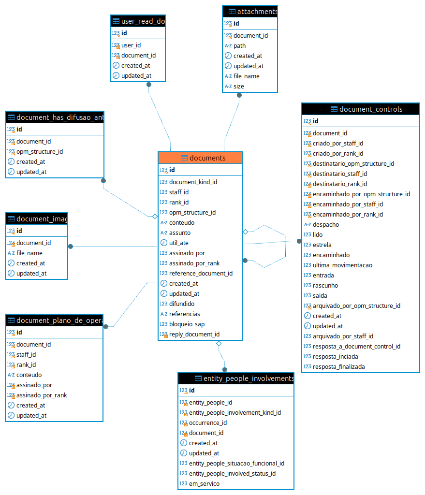

# Estrutura do Banco de Dados

## Visão Geral

O banco de dados do SINPOM é a espinha dorsal do sistema, permitindo armazenamento e a recuperação de dados criticos da plataforma, incluindo contas de usuários, funções, logs de acesso e entidades específicas. Ele usa o MySQL como sgbd, e foi projetado para funcionar perfeitamente com o ORM do Laravel (Eloquent) e é estruturado para se alinhar à arquitetura MVC.

## Tabelas Principais

### 1. **`users`**: Gerencia detalhes da conta do usuário

| Field Name        | Data Type    | Description                   |
| ----------------- | ------------ | ----------------------------- |
| id                | INT          | Primary key, auto-increment.  |
| name              | VARCHAR(255) | User's full name.             |
| email             | VARCHAR(255) | Unique email address.         |
| email_verified_at | TIMESTAMP    | Email verification timestamp. |
| password          | VARCHAR(255) | Encrypted password.           |
| remember_token    | VARCHAR(100) |                               |
| google2fa_secret  | VARCHAR(255) |                               |
| created_at        | TIMESTAMP    | Record creation timestamp.    |
| updated_at        | TIMESTAMP    | Record last update timestamp. |

### 2. **`documents`**: Tabela de documentos.

| Field Name            | Data Type       | Description                        |
| --------------------- | --------------- | ---------------------------------- |
| id                    | BIGINT unsigned | Primary key, auto-increment        |
| document_kind_id      | BIGINT unsigned | tipo do documento                  |
| staff_id              | BIGINT unsigned | matricula do criador               |
| rank_id               | BIGINT unsigned | posto/graduacao do criador         |
| opm_structure_id      | BIGINT unsigned | seção do criador do documento      |
| assinado_por          | BIGINT unsigned | assinatura do documento finalizado |
| assinado_por_rank     | BIGINT unsigned | assinatura do documento finalizado |
| reference_document_id | BIGINT unsigned | documento que deu origem a este    |
| reply_document_id     | BIGINT unsigned |                                    |
| util_ate              | DATE            | prazo aceitável do documento       |
| conteudo              | TEXT            |                                    |
| difundido             | TINYINT(1)      |                                    |
| bloqueio_sap          | TINYINT(1)      |                                    |
| assunto               | VARCHAR(191)    |                                    |
| referencias           | VARCHAR(191)    |                                    |
| created_at            | TIMESTAMP       | Record creation timestamp.         |
| updated_at            | TIMESTAMP       | Record last update timestamp.      |

### 3. **`entity_people`**: Tabela de entidade de pessoas

| Field Name                          | Data Type       | Description                      |
| ----------------------------------- | --------------- | -------------------------------- |
| id                                  | BIGINT unsigned | Primary key, auto-increment.     |
| nome                                | VARCHAR(191)    | Name of the person.              |
| pai                                 | VARCHAR(191)    | Father's name.                   |
| mae                                 | VARCHAR(191)    | Mother's name.                   |
| apelido                             | VARCHAR(191)    | Nickname of the person.          |
| profissao                           | VARCHAR(191)    | Profession of the person.        |
| staff_id                            | BIGINT          | Reference to staff.              |
| opm_id                              | BIGINT unsigned | Reference to OPM.                |
| entity_people_situacao_funcional_id | BIGINT          | Functional situation reference.  |
| entity_people_involved_status_id    | BIGINT          | Involved status reference.       |
| gender_id                           | BIGINT          | Gender reference.                |
| entity_people_color_id              | BIGINT          | Color reference.                 |
| entity_people_priority_level_id     | BIGINT          | Priority level reference.        |
| data_de_nascimento                  | DATE            | Date of birth.                   |
| em_servico                          | TINYINT         | Indicates if on service.         |
| created_at                          | TIMESTAMP       | Record creation timestamp.       |
| updated_at                          | TIMESTAMP       | Last update timestamp.           |
| weapon_kind_id                      | BIGINT unsigned | Reference to weapon kind.        |
| lesoes_multiplas                    | TINYINT         | Indicates multiple injuries.     |
| cpf                                 | VARCHAR(191)    | CPF number.                      |
| rg                                  | VARCHAR(191)    | RG number.                       |
| created_by_staff_id                 | BIGINT unsigned | Staff ID who created the record. |
| PRIMARY KEY                         | ID              | Primary key of the table.        |
| FOREIGN KEY (created_by_staff_id)   | STAFF(ID)       | References `staff` table.        |
| FOREIGN KEY (opm_id)                | OPMS(ID)        | References `opms` table.         |

## Principais Relacionamentos

### Relationamentos de `users`


### Relationamentos de `documents`



## Exemplo de Consulta SQL

Lista todos os agentes de uma OPM ou de um CPR

```sql
   $user = Auth::user();
      $opm = Opm::find($request->opm_id);
      $isCpr = $opm ? $opm->grande_comando : null;
      $agentsQuery = User::join('staff', 'users.staff_id','=','staff.id')
         ->leftJoin('agent_request_for_inclusions', 'agent_request_for_inclusions.staff_id', '=', 'staff.id')
         ->join('opms','opms.id', '=', 'staff.opm_id')
         ->join('model_has_roles','users.id','=','model_has_roles.model_id')
         ->join('ranks','staff.rank_id','=','ranks.id')
         ->join('roles', 'roles.id', '=', 'model_has_roles.role_id')
         ->whereNotIn('roles.name', ['Comandante - OPM', 'Subcomandante - OPM', 'Comandante - CPR', 'Subcomandante - CPR'])
         ->when(($request->opm_id == $user->staff->opm_id) and ($isCpr), function($q) use ($request){
            $q->where('opms.cpr_id', $request->opm_id);
         })
         ->when($request->opm_id, function($q) use ($request){
            $q->where('staff.opm_id',$request->opm_id);
         })
         ->when(!$request->opm_id and $user->hasAnyPermission(['Consultar agentes OPM']), function($q) use ($user){
            $q->where('staff.opm_id',$user->staff->opm_id);
         })
         ->when(($request->staff_id) and $user->hasAnyPermission(['Consultar agentes OPM']), function($q) use ($request, $user){
            $q->where('staff.opm_id',$user->staff->opm_id)
            ->where('users.id', Crypt::decrypt($request->staff_id));
         })
         ->when(!$request->opm_id and $user->hasAnyPermission(['Consultar agentes CPR']), function($q) use ($user){
            $q->where('opms.cpr_id', $user->staff->opm->cpr_id);
         })
         ->when(($request->staff_id) and $user->hasAnyPermission(['Consultar agentes CPR']), function($q) use ($request, $user){
            $q->where('opms.cpr_id', $user->staff->opm->cpr_id)
            ->where('users.id', Crypt::decrypt($request->staff_id));
         })
         ->when(($request->staff_id) and $user->hasAnyPermission(['Ver todos agentes']), function($q) use ($request, $user){
            $q->where('users.id', Crypt::decrypt($request->staff_id));
         })->groupBy('staff.id');
      $agentsCountByRank = $agentsQuery->select('users.*')->orderBy('ranks.nivel')->get()->countBy('staff.rank.rank');
      $agents = $agentsQuery->select('users.*')->orderBy('ranks.nivel')->orderBy('staff.id')->paginate(50);
```

## Diagrama ER


