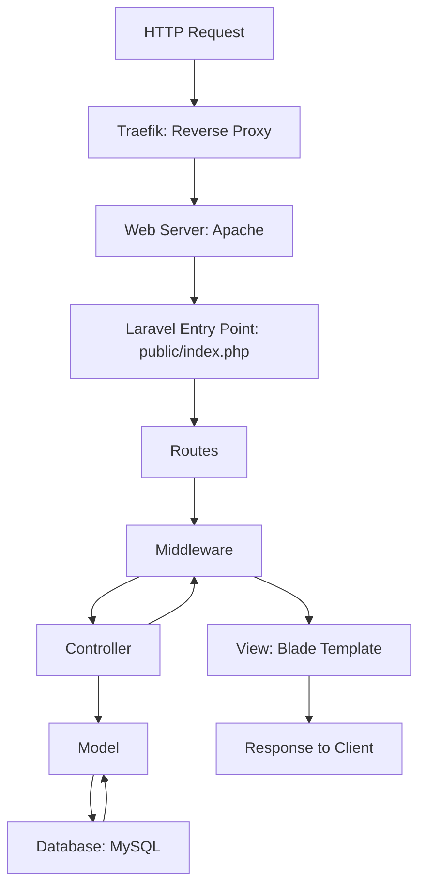

# Arquitetura do Projeto

## Arquitetura Geral

O SINPOM utiliza uma arquitetura baseada no padrão **MVC (Model-View-Controller)**.

- **Frontend**: Desenvolvido com Laravel Blade.
- **Backend**: Desenvolvido com Laravel, utilizando PHP 8.0.
- **Banco de dados**: MySQL 8.0.
- **Proxy Reverso**: Traefik para gerenciamento de rotas e certificados SSL.
- **Docker**: Para gerenciamento de containeres e imagens Docker.
- **Git/GitHub**: Para controle de versões.

## Diagrama Arquitetural



## Justificativa das Tecnologias

- **Laravel**: Pela sua simplicidade e suporte MVC.
- **Docker**: Para garantir consistência de ambiente de desenvolvimento e produção.
- **Traefik**: Para facilitar a configuração de HTTPS e roteamento dinâmico.

# Estrutura do Projeto

## Estrutura do Projeto com Docker

O projeto do sinpom utiliza o Docker para gerenciamento de containeres e imagens Docker. Ele utiliza o Docker Compose para gerenciamento de containeres e imagens Docker.

```plaintext
docker-compose-dev-ubuntu.yml
docker-compose-local.yml
docker-compose.yml
Dockerfile
.env
```

## Estrutura do Laravel

O projeto do sinpom utiliza o framework Laravel para desenvolvimento da aplicação. Ele utiliza o Composer para gerenciamento de dependências do projeto.

```plaintext
/app
├── Console
├── Exceptions
├── Http
│   ├── Controllers
│   ├── Middleware
│   ├── Library
│   ├── Mail
│   ├── Providers
│   └── Scopes
/bootstrap
/config
/database
/public
/resources
├── views
├── assets
/routes
/storage
/tests
/vendor
composer.json
package.json
```
